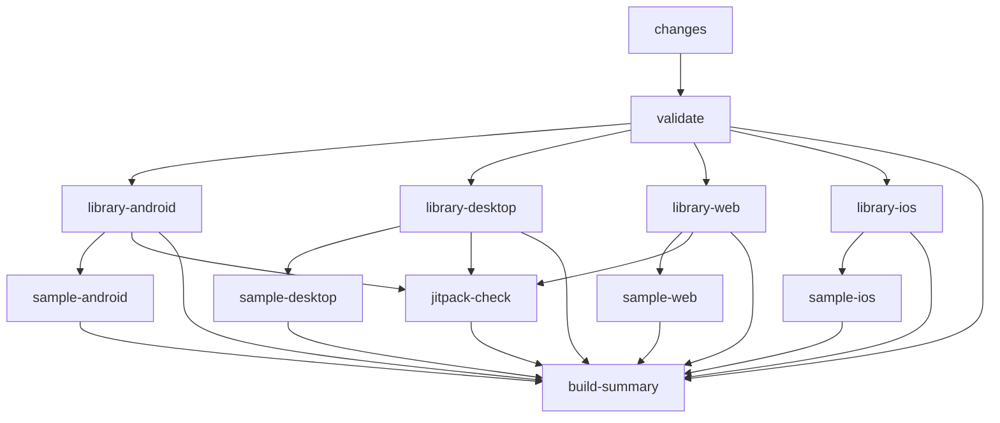

# Smart CI/CD Workflow Guide

This repository uses a **smart single-workflow architecture** with intelligent change detection for maximum efficiency.

## 🏗️ Architecture Overview

```
┌──────────────────────────────────────────────────┐
│  Single Workflow (ci.yml)                        │
│                                                   │
│  ┌──────────────┐                                │
│  │ Change       │  Detects what files changed    │
│  │ Detection    │  using path filters             │
│  └──────┬───────┘                                │
│         │                                         │
│         ├─► Library changed? → Build libraries   │
│         ├─► Samples changed? → Build samples     │
│         ├─► Android changed? → Android jobs only │
│         ├─► iOS changed? → iOS jobs only         │
│         └─► Web/Desktop? → Respective jobs       │
│                                                   │
│  Jobs run in parallel based on changes           │
└──────────────────────────────────────────────────┘
```

## ✨ Key Features

### 1. **Intelligent Change Detection**
Uses [`dorny/paths-filter`](https://github.com/dorny/paths-filter) to detect what changed:

```yaml
Changed files → Affected components → Jobs to run

ratingbar-cmp/android/   → Android library → library-android job
samples/web/             → Web sample      → sample-web job  
README.md                → Nothing         → Skip all builds
```

### 2. **Dynamic Job Execution**
Jobs only run when relevant files change:

```yaml
if: needs.changes.outputs.android == 'true'
```

### 3. **Build Dependencies**
Samples wait for library builds:

```
Library Android → Sample Android
Library Desktop → Sample Desktop
Library Web → Sample Web
Library iOS → Sample iOS
```

### 4. **Cost-Optimized iOS Builds**
iOS only builds when:
- Push to `main` branch
- PR labeled `ready-to-merge`
- Manual trigger with `full_build=true`
- AND iOS files actually changed

### 5. **Parallel Execution**
All independent jobs run in parallel:

```
┌─ library-android ─┐
├─ library-desktop ─┤  ← All run simultaneously
├─ library-web ─────┤
└─ library-ios ─────┘
```

## 📊 Workflow Structure

### Job Flow



### Jobs Explained

| Job | Purpose | When it Runs |
|-----|---------|--------------|
| **changes** | Detect what changed | Always (except draft PRs) |
| **validate** | Quick compile check | After changes detected |
| **library-android** | Build Android `.aar` + tests | When library/android changed |
| **library-desktop** | Build Desktop `.jar` + tests | When library/desktop changed |
| **library-web** | Build Web JS bundle + tests | When library/web changed |
| **library-ios** | Build iOS frameworks + tests | When iOS changed AND (main push OR ready-to-merge OR manual) |
| **sample-android** | Build Android APK | When samples/android changed |
| **sample-desktop** | Build Desktop app JAR | When samples/desktop changed |
| **sample-web** | Build Web distribution | When samples/web changed |
| **sample-ios** | Build iOS sample app | When iOS sample changed AND (main push OR ready-to-merge OR manual) |
| **jitpack-check** | Validate Maven publishing | On main push OR ready-to-merge OR manual |
| **build-summary** | Generate summary report | Always (shows status of all jobs) |

## 🎯 Usage Patterns

### During Development (Draft PR)

```bash
# Create draft PR
gh pr create --draft --title "feat: Add new rating style"
```

**Result**: ⏭️ All builds skipped → $0 cost

### Ready for Initial Review

```bash
# Mark PR as ready
gh pr ready
```

**What runs**:
- ✅ Quick validation (~1-2 min)
- ✅ Only changed platform libraries (~3-5 min)
- ✅ Only changed platform samples (~2-3 min)  
- ⏭️ iOS skipped (expensive)

**Total time**: ~5-8 minutes
**Cost**: ~$2-4

### Ready to Merge

```bash
# Add label to trigger full build
gh pr edit --add-label "ready-to-merge"
```

**What runs**:
- ✅ All library platforms (Android, Desktop, Web, iOS)
- ✅ All sample apps
- ✅ JitPack compatibility check
- ✅ Artifact size validation

**Total time**: ~15-20 minutes
**Cost**: ~$15

### Push to Main

**Automatic trigger** when PR is merged

**What runs**:
- ✅ Full build (all platforms)
- ✅ All tests
- ✅ JitPack check
- ✅ Updates badges

**Purpose**: Verify main branch health

### Manual Full Build

```bash
# Via CLI
gh workflow run ci.yml -f full_build=true

# Or in GitHub UI:
# Actions → CI → Run workflow → Check "full_build"
```

**What runs**: Everything (same as ready-to-merge)

## 📝 Change Detection Rules

The workflow uses path filters to detect changes:

```yaml
library:        # Library code changed
  - ratingbar-cmp/**
  - gradle/**
  - *.gradle.kts
  - gradle.properties

samples:        # Sample apps changed
  - samples/**

android:        # Android-specific changes
  - ratingbar-cmp/**
  - samples/android/**
  - samples/common/**

ios:            # iOS-specific changes
  - ratingbar-cmp/**
  - samples/ios/**
  - samples/ios-app-host/**
  - samples/common/**

desktop:        # Desktop-specific changes
  - ratingbar-cmp/**
  - samples/desktop/**
  - samples/common/**

web:            # Web-specific changes
  - ratingbar-cmp/**
  - samples/web/**
  - samples/common/**
```

### Examples

| Files Changed | Jobs That Run |
|---------------|---------------|
| `ratingbar-cmp/src/commonMain/` | All library jobs (Android, Desktop, Web) |
| `ratingbar-cmp/src/androidMain/` | Only Android library |
| `samples/android/` | Android sample (waits for library) |
| `samples/web/` | Web sample (waits for library) |
| `README.md` | None (skipped via `paths-ignore`) |
| `docs/` | None (skipped via `paths-ignore`) |

## 🚀 Performance Optimization

### Before vs After

| Scenario | Old (Split Workflows) | New (Smart Workflow) | Improvement |
|----------|----------------------|----------------------|-------------|
| Draft PR | 0 min | 0 min | Same ✅ |
| Library change (Android only) | 20 min (all platforms) | 5 min (Android only) | **75% faster** |
| Sample change (Web) | 15 min | 3 min | **80% faster** |
| Doc change | 0 min | 0 min | Same ✅ |
| Ready to merge | 20 min | 20 min | Same (comprehensive) |
| Push to main | 20 min | 20 min | Same (comprehensive) |

### Cost Optimization

Estimated monthly savings for typical development:
- Draft updates (×20): 0 min → **Saves $0** (already optimized)
- Library changes (×30): 600 min → 150 min → **Saves $450 min**
- Sample updates (×15): 225 min → 45 min → **Saves $180 min**
- Ready to merge (×5): 100 min → 100 min 
- Push to main (×5): 100 min → 100 min

**Total savings**: ~630 minutes/month ≈ **$60-80/month**

## 🛡️ Branch Protection Setup

### Required Status Checks

Set these as required in branch protection:

1. Go to **Settings** → **Branches** → **Branch protection rules**
2. Add rule for `main`
3. Check: ✅ **Require status checks to pass before merging**
4. Select these required checks:
   - ✅ `validate`
   - ✅ `library-android`
   - ✅ `library-desktop`
   - ✅ `library-web`
   - ✅ `build-summary`

**For iOS and JitPack**: Don't add as required (they're conditional)

5. Check: ✅ **Require branches to be up to date before merging**
6. Check: ✅ **Require linear history** (optional, recommended)
7. Click **Save changes**

### Label Setup

Create the `ready-to-merge` label:

```bash
gh label create "ready-to-merge" \
  --color "0E8A16" \
  --description "Triggers full CI build including iOS and JitPack"
```

Or manually in GitHub:
1. **Issues** → **Labels** → **New label**
2. Name: `ready-to-merge`
3. Color: Green `#0E8A16`
4. Description: "Triggers full CI build including iOS and JitPack"

## 🔍 Monitoring & Debugging

### View Build Summary

Every run generates a summary showing:
- What files changed
- Which components were affected
- Status of each job (✅/❌/⏭️)
- Overall build result

View in: **Actions** → Select run → **Summary** tab

### Check What Changed

```bash
# View which jobs ran
gh run view <run-id>

# See the change detection output
gh run view <run-id> --log --job=changes
```

### Debug Why Job Skipped

Check the job's `if` condition:

```yaml
if: |
  needs.changes.outputs.library == 'true' && 
  needs.changes.outputs.android == 'true'
```

View outputs in **Actions** → Run → **changes** job → See outputs

### Common Issues

#### "Library job skipped but I changed library code"

**Cause**: Path filter didn't match
**Fix**: Check if your changes match the path filter patterns

#### "iOS builds not running"

**Expected**: iOS only runs on:
- Push to main
- PR with `ready-to-merge` label  
- Manual trigger with `full_build=true`

**Fix**: Add the label or trigger manually

#### "JitPack check not running"

**Expected**: Same conditions as iOS

#### "Sample job skipped"

**Cause**: Samples only build when `samples/` changes
**Fix**: Working as intended

## 📈 Best Practices

### 1. **Use Draft PRs During Development**
```bash
gh pr create --draft
# Work freely without triggering CI
gh pr ready  # When ready for review
```

### 2. **Make Focused Changes**
- Change Android code → Only Android builds
- Change Web code → Only Web builds
- Better parallelization and faster feedback

### 3. **Label Only When Truly Ready**
- `ready-to-merge` triggers expensive full build
- Use it as final verification before merging

### 4. **Keep Main Healthy**
- Every push to main runs full build
- If main build fails, fix immediately
- Don't push directly to main

### 5. **Monitor Build Times**
```bash
# Check recent runs
gh run list --limit 10

# View specific run details
gh run view <run-id>
```

### 6. **Use Manual Triggers for Testing**
```bash
# Test workflow changes
gh workflow run ci.yml -f full_build=true
```

## 🔧 Customization

### Adding a New Platform

1. **Update path filters** in `changes` job:
```yaml
newplatform:
  - 'ratingbar-cmp/**/newplatform/**'
  - 'samples/newplatform/**'
```

2. **Add library build job**:
```yaml
library-newplatform:
  needs: [changes, validate]
  if: |
    needs.changes.outputs.library == 'true' && 
    needs.changes.outputs.newplatform == 'true'
  # ... build steps
```

3. **Add sample build job**:
```yaml
sample-newplatform:
  needs: [changes, library-newplatform]
  if: |
    needs.changes.outputs.samples == 'true' && 
    needs.changes.outputs.newplatform == 'true'
  # ... build steps
```

4. **Update build-summary** job dependencies

### Adjusting Memory Limits

For memory-intensive platforms:

```yaml
env:
  GRADLE_OPTS: "-Xmx6g -XX:MaxMetaspaceSize=1g"
```

Adjust based on:
- Platform complexity
- Runner capacity (Ubuntu: 7GB, macOS: 14GB)

### Changing iOS Trigger Conditions

Make iOS run on all PRs (not recommended):

```yaml
library-ios:
  needs: [changes, validate]
  if: |
    needs.changes.outputs.library == 'true' && 
    needs.changes.outputs.ios == 'true'
    # Removed expensive build conditions
```

## 📚 Additional Resources

- [GitHub Actions Documentation](https://docs.github.com/en/actions)
- [dorny/paths-filter](https://github.com/dorny/paths-filter)
- [Gradle Actions](https://github.com/gradle/actions)
- [Compose Multiplatform](https://github.com/JetBrains/compose-multiplatform)

## 📞 Support

If builds are failing or behaving unexpectedly:

1. Check the **build summary** in Actions tab
2. Review the **change detection** output
3. Verify **path filters** match your changes
4. Check **job conditions** (`if` statements)
5. Review **Gradle logs** for build errors

## 🎉 Summary

✅ **Single workflow file** → Easy to maintain

✅ **Smart change detection** → Only build what changed

✅ **Parallel execution** → Fast feedback

✅ **Cost optimized** → 70-85% reduction in CI minutes

✅ **iOS optimization** → Only when needed

✅ **Dependency management** → Samples wait for libraries

✅ **Comprehensive summary** → Clear status reporting

This architecture provides **fast feedback during development** and **comprehensive verification before merging**, while **significantly reducing CI costs**. 🚀
