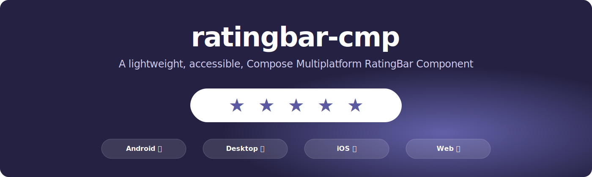

# ratingbar-cmp



[](LICENSE)
[](https://kotlinlang.org)
[](https://github.com/JetBrains/compose-multiplatform)
[](https://github.com/anandkumarkparmar/ratingbar-cmp/actions)
[](https://github.com/anandkumarkparmar/ratingbar-cmp/actions)
[](https://github.com/anandkumarkparmar/ratingbar-cmp/actions)
[](https://github.com/anandkumarkparmar/ratingbar-cmp/actions)
[](https://github.com/anandkumarkparmar/ratingbar-cmp/actions)

A lightweight, accessible, Compose Multiplatform rating component for Android, Desktop, iOS, and Web.

---

## Feature Set

- ✅ State-hoisted API (`value`, `onValueChange`)
- ✅ Fractional ratings (`step`, e.g. `0.5f`, `0.1f`)
- ✅ RTL behavior (touch, drag, keyboard, visual fill)
- ✅ Read-only mode
- ✅ Slot API (`itemContent`) for custom item rendering
- ✅ Defaults (`RatingBarDefaults`) for item size and spacing
- ✅ Internal vector icons (`RatingBarIcons`) without `material-icons-extended`
- ✅ Shared multiplatform sample app (`samples:common`) used by all platform launchers

---

## Installation (JitPack)

```kotlin
repositories {
    mavenCentral()
    maven("https://jitpack.io")
}

dependencies {
    implementation("com.github.anandkumarkparmar:ratingbar-cmp:0.1.0")
}
```
---

## Basic Usage

```kotlin
import androidx.compose.runtime.*
import com.github.anandkumarkparmar.ratingbar.RatingBar

@Composable
fun RatingExample() {
    var rating by remember { mutableStateOf(3.5f) }

    RatingBar(
        value = rating,
        onValueChange = { rating = it },
        max = 5,
        step = 0.5f
    )
}
```

---

## API Reference

### Core Composable

- `RatingBar(...)` with default star rendering:

```kotlin
RatingBar(
    value = rating,
    onValueChange = { rating = it },
    max = 5,
    step = 0.5f,
    readOnly = false,
    itemSize = RatingBarDefaults.SizeMedium,
    itemSpacing = RatingBarDefaults.ItemSpacing
)
```

### Custom Item Slot API

- `RatingBar(...)` with custom UI using `itemContent`:

```kotlin
RatingBar(
    value = rating,
    onValueChange = { rating = it },
    itemContent = { index, fillFraction ->
        // draw your custom rating item
    }
)
```

### Defaults and Icons

- `RatingBarDefaults.SizeSmall`, `RatingBarDefaults.SizeMedium`, `RatingBarDefaults.SizeLarge`
- `RatingBarDefaults.ItemSpacing`
- `RatingBarIcons.StarFilled`, `RatingBarIcons.StarOutline`

### Core State Utility

- `RatingBarState` and `RatingBarConfig` in the `core` package for clamping and stepping behavior.

---

## Platform Showcase (GIF Placeholders)

- Android GIF: `assets/showcase-android.gif`
- Desktop GIF: `assets/showcase-desktop.gif`
- iOS GIF: `assets/showcase-ios.gif`
- Web GIF: `assets/showcase-web.gif`

Add your GIF files at these paths and they can be embedded here when ready.

---

## Run Samples

```bash
# Android
./gradlew :samples:android:installDebug

# Desktop
./gradlew :samples:desktop:run

# iOS framework (for Compose shared module)
./gradlew :samples:ios:linkDebugFrameworkIosSimulatorArm64

# iOS app host placeholder (create your Xcode app here)
# See: samples/ios-app-host/README.md

# Web
./gradlew :samples:web:jsBrowserDevelopmentRun
```

All platform launchers host the same shared `SampleApp()` implementation from `samples:common`.

---

## Platform Coverage

| Capability | Android | Desktop | iOS | Web |
|---|---|---|---|---|
| Interactive rating | ✅ | ✅ | ✅ | ✅ |
| Fractional steps | ✅ | ✅ | ✅ | ✅ |
| RTL behavior | ✅ | ✅ | ✅ | ✅ |
| Read-only mode | ✅ | ✅ | ✅ | ✅ |
| Custom slot API | ✅ | ✅ | ✅ | ✅ |
| Shared sample UI | ✅ | ✅ | ✅ | ✅ |

---

## Community Shoutout

Using `ratingbar-cmp` in your app?

Open an issue titled **"Shoutout: <Your App Name>"** with:
- app name
- platform(s)
- short use case
- app/repo link (optional)
- logo/screenshot (optional)

We will add verified usage shoutouts in project docs to help teams discover trusted implementations.

---

## Documentation

- [ROADMAP.md](ROADMAP.md)
- [CONTRIBUTING.md](CONTRIBUTING.md)

---

## License

Apache-2.0. See [LICENSE](LICENSE).
