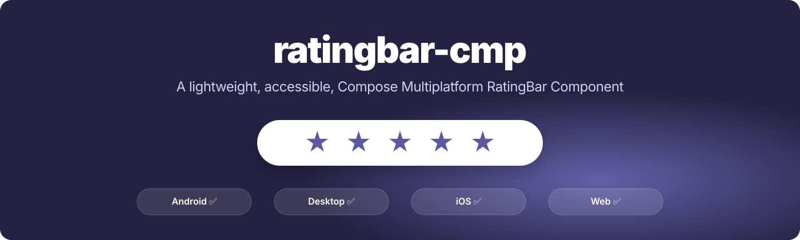

<div align="center">



[](https://jitpack.io/#anandkumarkparmar/ratingbar-cmp)
[](LICENSE)
[](https://kotlinlang.org)
[](https://github.com/JetBrains/compose-multiplatform)
[](https://anandkumarkparmar.github.io/ratingbar-cmp/)
[](https://anandkumarkparmar.github.io/ratingbar-cmp/demo/)

[](https://github.com/anandkumarkparmar/ratingbar-cmp/actions)
[](https://github.com/anandkumarkparmar/ratingbar-cmp/actions)
[](https://github.com/anandkumarkparmar/ratingbar-cmp/actions)
[](https://github.com/anandkumarkparmar/ratingbar-cmp/actions)
[](https://github.com/anandkumarkparmar/ratingbar-cmp/actions)

A lightweight, accessible, Compose Multiplatform RatingBar component for Android, Desktop, iOS, and Web.

</div>

---

## See It in Action

<table align="center">
  <tr>
    <td align="center" width="100"><b>Android</b></td>
    <td align="center"></td>
  </tr>
  <tr>
    <td align="center"><b>Desktop</b></td>
    <td align="center"></td>
  </tr>
</table>

iOS and Web are fully supported too — try the [live web demo](https://anandkumarkparmar.github.io/ratingbar-cmp/demo/) in your browser, or clone the repo and [run the samples locally](SETUP.md).

---

## Why ratingbar-cmp?

- **Zero extra dependencies** — only Compose Multiplatform, nothing else
- **Fractional steps** — 0.5, 0.25, or any custom step size
- **Fully accessible** — keyboard navigation, RTL layout, screen reader semantics on all platforms
- **Slot API** — supply any composable as a rating item (hearts, circles, custom icons)
- **Platform-native feel** — hover preview on Desktop/Web, haptic feedback on Android, mouse wheel support
- **Gradient fills** — apply a color gradient brush via `RatingBarColors.fillBrush`
- **Shimmer placeholder** — `RatingBarPlaceholder` renders an animated skeleton while data loads
- **Long-press to reset** — opt-in long-press resets to effective minimum via `RatingBarBehavior`
- **Shape variety** — built-in Heart, ThumbUp, and Circle icon pairs alongside the default stars

---

## Installation

```kotlin
repositories {
    mavenCentral()
    maven("https://jitpack.io")
}

dependencies {
    implementation("com.github.anandkumarkparmar.ratingbar-cmp:ratingbar-cmp:0.5.0")
}
```

---

## Basic Usage

Two lines — that's all you need for a working rating bar with default stars, integer steps, and Material-themed colors:

```kotlin
var rating by rememberRatingBarState(initialValue = 3f)
RatingBar(value = rating, onValueChange = { rating = it })
```

### With options

Half-star steps, large items, animations, and haptic feedback on Android:

```kotlin
import androidx.compose.runtime.*
import com.github.anandkumarkparmar.ratingbar.*

@Composable
fun RatingExample() {
    var rating by rememberRatingBarState(initialValue = 3f)

    RatingBar(
        value = rating,
        onValueChange = { rating = it },
        config = RatingBarConfig(max = 5, step = 0.5f),
        style = RatingBarDefaults.style(itemSize = RatingBarDefaults.SizeLarge),
        animations = RatingBarDefaults.animations(enabled = true, animateScale = true),
        behavior = RatingBarDefaults.behavior(hapticFeedback = true),
    )
}
```

For all parameters and type signatures, browse the [live API docs](https://anandkumarkparmar.github.io/ratingbar-cmp/) — they're auto-generated from KDoc on every release. For common usage patterns with code snippets, see [Usage Examples](docs/USAGE.md). To try the library interactively without installing anything, open the [live web demo](https://anandkumarkparmar.github.io/ratingbar-cmp/demo/).

---

## Platform Coverage

| Feature | Android | Desktop | iOS | Web |
|---|---|---|---|---|
| Core `RatingBar` composable | ✓ | ✓ | ✓ | ✓ |
| Tap + drag interaction | ✓ | ✓ | ✓ | ✓ |
| Keyboard interaction | ✓ | ✓ | ✓* | ✓ |
| Fractional values | ✓ | ✓ | ✓ | ✓ |
| RTL support | ✓ | ✓ | ✓ | ✓ |
| Read-only mode | ✓ | ✓ | ✓ | ✓ |
| Slot API | ✓ | ✓ | ✓ | ✓ |
| Fill animation | ✓ | ✓ | ✓ | ✓ |
| Scale-on-select animation | ✓ | ✓ | ✓ | ✓ |
| Minimum value constraint | ✓ | ✓ | ✓ | ✓ |
| Hover preview | — | ✓ | — | ✓ |
| Mouse wheel scroll | — | ✓ | — | — |
| Haptic feedback | ✓ | — | — | — |
| Long-press to reset | ✓ | ✓ | ✓ | ✓ |
| Shimmer placeholder | ✓ | ✓ | ✓ | ✓ |

\* Keyboard behavior on iOS depends on the runtime input context.<br>
— Feature is a graceful no-op on this platform — no crash, no error.

---

## What's Coming

A glimpse of what's planned for future releases. See the [full roadmap](docs/ROADMAP.md) for details.

| Feature | Status |
|---|---|
| Gesture sensitivity configuration | Planned |
| Compact / inline mode | Planned |
| Badge mode (★ 4.5) | Planned |
| Kotlin/Wasm target | Planned |

---

## Documentation

- [Setup Guide](SETUP.md) — install prerequisites, clone, run the samples
- [Usage Examples](docs/USAGE.md) — common patterns with code snippets
- [Live API Docs](https://anandkumarkparmar.github.io/ratingbar-cmp/) — auto-generated reference for every type
- [Live Web Demo](https://anandkumarkparmar.github.io/ratingbar-cmp/demo/) — try it interactively in a browser
- [Discussions](https://github.com/anandkumarkparmar/ratingbar-cmp/discussions) — ask questions, share ideas, or show how you're using the library
- [Contributing](CONTRIBUTING.md) — first-time contributor? start here
- [Roadmap](docs/ROADMAP.md) — what might come next
- [Changelog](CHANGELOG.md) — release history with migration notes
- [Publishing Checklist](docs/PUBLISHING_CHECKLIST.md) — for maintainers cutting a release
- [CI/CD Guide](docs/CI_GUIDE.md) — how the GitHub Actions pipeline works
- [Code of Conduct](CODE_OF_CONDUCT.md)

---

## Community Shoutout

Using `ratingbar-cmp` in your app? Open an issue titled **"Shoutout: \<Your App Name\>"** with your app name, platform(s), a short use case, and an optional link or screenshot.

---

## License

Apache-2.0. See [LICENSE](LICENSE).
