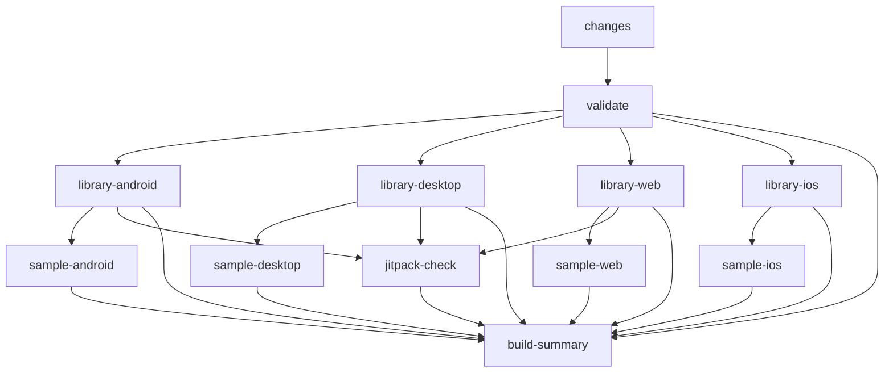

# CI/CD Guide

This document explains how the CI/CD pipeline works, when each job runs, and how to interact with it as a contributor. For the release process itself (tagging, publishing, verification), see [PUBLISHING_CHECKLIST.md](PUBLISHING_CHECKLIST.md).

---

## Architecture

A single workflow (`ci.yml`) with intelligent change detection handles all CI. A separate workflow (`release.yml`) handles tag-triggered releases.

```
ci.yml
  Change Detection (dorny/paths-filter)
      |
      +-- Library changed?    → Build + test libraries
      +-- Samples changed?    → Build samples (waits for library)
      +-- Platform changed?   → Only affected platform jobs
      +-- iOS changed?        → iOS jobs (macOS, restricted triggers)
      +-- Nothing relevant?   → Skip all builds

release.yml (tag-triggered)
  release-prep → publish-docs + create-github-release
```

---

## Change Detection Rules

The `changes` job uses [dorny/paths-filter](https://github.com/dorny/paths-filter) to detect what changed and flag affected components. Only jobs matching a flagged component actually run.

```yaml
library:
  - 'ratingbar-cmp/src/**'
  - 'ratingbar-cmp/api/**'
  - 'ratingbar-cmp/build.gradle.kts'
  - 'ratingbar-cmp/detekt.yml'
  - 'settings.gradle.kts'
  - 'gradle/**'
  - 'jitpack.yml'
  - '.github/workflows/ci.yml'
samples:
  - 'samples/**'
android:
  - 'ratingbar-cmp/src/**'
  - 'samples/android/**'
  - 'samples/common/**'
ios:
  - 'ratingbar-cmp/src/**'
  - 'samples/ios/**'
  - 'samples/ios-app-host/**'
  - 'samples/common/**'
desktop:
  - 'ratingbar-cmp/src/**'
  - 'samples/desktop/**'
  - 'samples/common/**'
web:
  - 'ratingbar-cmp/src/**'
  - 'samples/web/**'
  - 'samples/common/**'
```

### Push-only skip list

Pushes to `main` skip the entire workflow when only these files change:

```yaml
paths-ignore:
  - '**.md'
  - 'docs/**'
  - 'assets/**'
  - 'LICENSE'
  - '.gitignore'
```

Pull requests do **not** have a `paths-ignore` — the workflow always triggers, and the `changes` job determines which jobs actually run.

### Quick reference

| Files changed | Jobs that run |
|---|---|
| `ratingbar-cmp/src/commonMain/` | All library jobs + all platform samples |
| `ratingbar-cmp/api/` | Library validation (apiCheck) |
| `samples/android/` | Android sample (after library builds) |
| `samples/web/` | Web sample (after library builds) |
| `gradle.properties` or `gradle/**` | All library jobs |
| `README.md` | None (push: skipped via paths-ignore; PR: changes job runs but no component matches) |
| `docs/` | None (same reason) |

---

## Jobs

### Job flow



### Job details

| Job | Runner | What it does | Runs when |
|---|---|---|---|
| **changes** | ubuntu | Detects what changed via dorny/paths-filter | Always (unless draft PR) |
| **validate** | ubuntu | Quick compile (Desktop + Android) + `apiCheck` + `detekt` | After `changes` |
| **library-android** | ubuntu | `bundleAndroidMainAar` + `assembleUnitTest` | Library + Android changed |
| **library-desktop** | ubuntu | `desktopJar` + `desktopTest` | Library + Desktop changed |
| **library-web** | ubuntu | `jsJar` + `jsTest` | Library + Web changed |
| **library-ios** | **macos** | iOS frameworks (all 3 archs) + `iosSimulatorArm64Test` | Library + iOS changed AND (push to main OR `ready-to-merge` label OR manual) |
| **sample-android** | ubuntu | `assembleDebug` | Samples + Android changed (after library) |
| **sample-desktop** | ubuntu | `packageUberJarForCurrentOS` | Samples + Desktop changed (after library) |
| **sample-web** | ubuntu | `jsBrowserDistribution` | Samples + Web changed (after library) |
| **sample-ios** | **macos** | iOS Compose framework + Xcode build | Same as `library-ios` triggers |
| **jitpack-check** | ubuntu | `publishToMavenLocal` + artifact size enforcement | Push to main OR `ready-to-merge` OR manual |
| **build-summary** | ubuntu | Aggregates all job results into a summary report | Always |

### Cost notes

- **iOS jobs use macOS runners** (more expensive and slower). They're gated behind push-to-main / `ready-to-merge` / manual dispatch to avoid running on every PR push.
- All other jobs run on ubuntu-latest.
- Independent jobs run in parallel. The `build-summary` job waits for everything.

---

## Usage Patterns

### During development (draft PR)

```bash
gh pr create --draft --title "feat: add new rating style"
```

All CI is **skipped** for draft PRs (`github.event.pull_request.draft == false` gate).

### Ready for review

```bash
gh pr ready
```

Runs: `validate` (~1–2 min), affected library builds (~3–5 min), affected sample builds (~2–3 min). iOS is **skipped** (not push to main, no `ready-to-merge` label).

### Ready to merge

```bash
gh pr edit --add-label "ready-to-merge"
```

Runs: **everything** — all library platforms (including iOS), all samples, JitPack check, artifact size enforcement. This is the full validation gate before merge.

### Manual full build

```bash
gh workflow run ci.yml -f full_build=true
```

Same scope as `ready-to-merge`. Use this if you need a full build without labeling a PR.

---

## Release Workflow

The release workflow (`release.yml`) is triggered by pushing a tag matching `^0\.[0-9]+\.[0-9]+$` (no `v` prefix). See [PUBLISHING_CHECKLIST.md](PUBLISHING_CHECKLIST.md) for the full end-to-end process.

### Summary

| Job | What it does |
|---|---|
| `release-prep` | Validates tag format, runs `publishToMavenLocal` + `apiCheck` + `detekt`, builds all modules, enforces artifact size budgets, generates `release_notes.md` |
| `publish-docs` | Builds Dokka HTML + web demo, deploys to GitHub Pages |
| `create-github-release` | Creates a GitHub Release with release notes and size report attached |

`publish-docs` and `create-github-release` run in parallel after `release-prep` succeeds.

---

## Branch Protection

### Recommended required status checks

Go to **Settings → Branches → Branch protection rules → `main`**:

**Required (always run):**
- `validate`
- `library-android`
- `library-desktop`
- `library-web`
- `build-summary`

**Optional (conditional — only run when triggered):**
- `library-ios`
- `jitpack-check`

### Required label

Create the `ready-to-merge` label to gate full builds:

```bash
gh label create "ready-to-merge" \
  --color "0E8A16" \
  --description "Triggers full CI build including iOS and JitPack"
```

---

## Monitoring

### Build summary

Every CI run produces a summary showing what changed, which jobs ran, and their status. Find it at: **Actions → select a run → Summary tab**.

### CLI

```bash
gh run list --limit 10                     # recent runs
gh run view <run-id>                       # full run details
gh run view <run-id> --log --job=changes   # change detection output
```

---

## Troubleshooting

### "Library job skipped but I changed library code"

Verify your file paths match the `library` filter rules above. The most common miss: editing a file outside `ratingbar-cmp/src/` that you expected to trigger a library build (e.g., a root-level config file that isn't in the filter list).

### "iOS builds not running"

iOS only runs when **all three conditions** are true:
1. iOS-related files actually changed (per the `ios` filter).
2. Library files also changed (per the `library` filter).
3. Trigger is one of: push to `main`, PR with `ready-to-merge` label, or manual dispatch with `full_build=true`.

If any condition is false, iOS is skipped.

### "JitPack check not running"

Same trigger conditions as iOS — push to main, `ready-to-merge` label, or manual full build.

### "Sample job skipped"

Samples only build when files under `samples/` change **and** the corresponding platform filter matches. If you only changed library code, sample jobs won't run — this is intentional. The library build covers compilation correctness; samples test packaging.

### "CI passes but `release-check.sh` fails locally"

CI and `release-check.sh` run slightly different task sets. For example, CI's desktop sample uses `packageUberJarForCurrentOS` while `release-check.sh` uses `desktopJar`. If one passes and the other fails, check which specific task diverges. See [CONTRIBUTING.md § Pre-PR checklist](../CONTRIBUTING.md#pre-pr-checklist) for the recommended local validation commands.
