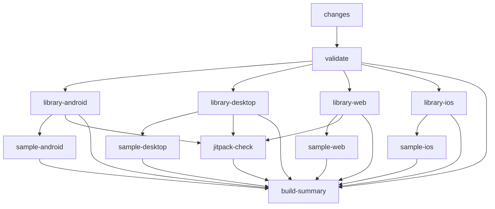

# CI/CD Guide

This repository uses a **smart single-workflow architecture** with intelligent change detection for maximum efficiency.

---

## Architecture Overview

```
Single Workflow (ci.yml)

  Change Detection (dorny/paths-filter)
      |
      +-- Library changed?  --> Build libraries
      +-- Samples changed?  --> Build samples
      +-- Android changed?  --> Android jobs only
      +-- iOS changed?      --> iOS jobs only
      +-- Web/Desktop?      --> Respective jobs

  Jobs run in parallel based on changes
```

---

## Key Features

### Intelligent Change Detection

Uses `dorny/paths-filter` to detect what changed and only run affected jobs:

```
Changed files --> Affected components --> Jobs to run

src/commonMain/           --> All libraries  --> library-android/desktop/web/ios jobs
samples/web/              --> Web sample     --> sample-web job
README.md                 --> Nothing        --> Skip all builds
```

### Build Dependencies

Samples wait for library builds:

```
Library Android --> Sample Android
Library Desktop --> Sample Desktop
Library Web     --> Sample Web
Library iOS     --> Sample iOS
```

### Cost-Optimized iOS Builds

iOS only builds when:
- Push to `main` branch
- PR labeled `ready-to-merge`
- Manual trigger with `full_build=true`
- AND iOS files actually changed

### Parallel Execution

All independent jobs run simultaneously, reducing total build time.

---

## Workflow Structure

### Job Flow



### Jobs

| Job | Purpose | When it Runs |
|---|---|---|
| **changes** | Detect what changed | Always (except draft PRs) |
| **validate** | Quick compile check | After changes detected |
| **library-android** | Build Android `.aar` + tests | When library/android changed |
| **library-desktop** | Build Desktop `.jar` + tests | When library/desktop changed |
| **library-web** | Build Web JS bundle + tests | When library/web changed |
| **library-ios** | Build iOS frameworks + tests | When iOS changed AND (main push OR ready-to-merge OR manual) |
| **sample-android** | Build Android APK | When samples/android changed |
| **sample-desktop** | Build Desktop app JAR | When samples/desktop changed |
| **sample-web** | Build Web distribution | When samples/web changed |
| **sample-ios** | Build iOS sample app | When iOS sample changed AND (main push OR ready-to-merge OR manual) |
| **jitpack-check** | Validate Maven publishing | On main push OR ready-to-merge OR manual |
| **build-summary** | Generate summary report | Always |

---

## Usage Patterns

### During Development (Draft PR)

```bash
gh pr create --draft --title "feat: Add new rating style"
```

All builds skipped.

### Ready for Initial Review

```bash
gh pr ready
```

Runs: Quick validation (~1-2 min), changed platform libraries (~3-5 min), changed platform samples (~2-3 min). iOS skipped.

### Ready to Merge

```bash
gh pr edit --add-label "ready-to-merge"
```

Runs: All library platforms, all sample apps, JitPack check, artifact size validation.

### Manual Full Build

```bash
gh workflow run ci.yml -f full_build=true
```

---

## Change Detection Rules

```yaml
library:   src/**, gradle/**, *.gradle.kts, gradle.properties
samples:   samples/**
android:   src/**, samples/android/**, samples/common/**
ios:       src/**, samples/ios/**, samples/ios-app-host/**, samples/common/**
desktop:   src/**, samples/desktop/**, samples/common/**
web:       src/**, samples/web/**, samples/common/**
```

### Examples

| Files Changed | Jobs That Run |
|---|---|
| `src/commonMain/` | All library jobs |
| `samples/android/` | Android sample (waits for library) |
| `samples/web/` | Web sample (waits for library) |
| `README.md` | None (skipped via `paths-ignore`) |
| `docs/` | None (skipped via `paths-ignore`) |

---

## Release Workflow (`release.yml`)

Triggered by tags matching `0.*` or `v0.*`, or manual dispatch.

Steps:
1. Resolve and validate tag format (`0.x.y` or `v0.x.y`)
2. `publishToMavenLocal`
3. API compatibility check (`apiCheck`)
4. Detekt static analysis
5. Build Android release artifact
6. Run `report-artifact-sizes.sh --enforce` (enforces size budgets, generates badge JSONs)
7. Build all modules (excluding iOS tests)
8. Generate `release_notes.md` with size snapshot and dependency snippet
9. Upload artifact-size report and release notes
10. Build web sample (`jsBrowserDistribution`)
11. Stage combined GitHub Pages artifact: Dokka HTML at `/`, web demo at `/demo/`
12. Deploy to GitHub Pages — Dokka at `https://anandkumarkparmar.github.io/ratingbar-cmp/`, live demo at `.../demo/`

---

## Branch Protection Setup

### Required Status Checks

1. Go to **Settings** > **Branches** > **Branch protection rules**
2. Add rule for `main`
3. Required checks:
   - `validate`
   - `library-android`
   - `library-desktop`
   - `library-web`
   - `build-summary`

4. Optional (conditional): `library-ios`, `jitpack-check`

### Label Setup

```bash
gh label create "ready-to-merge" \
  --color "0E8A16" \
  --description "Triggers full CI build including iOS and JitPack"
```

---

## Troubleshooting

### "Library job skipped but I changed library code"

Check if your changes match the path filter patterns in the `changes` job.

### "iOS builds not running"

iOS only runs on: push to main, PR with `ready-to-merge` label, or manual trigger with `full_build=true`.

### "JitPack check not running"

Same conditions as iOS builds.

### "Sample job skipped"

Samples only build when files in `samples/` change. This is working as intended.

---

## Monitoring

### Build Summary

Every run generates a summary showing what changed, which components were affected, and the status of each job. View in: **Actions** > Select run > **Summary** tab.

### CLI

```bash
gh run list --limit 10
gh run view <run-id>
gh run view <run-id> --log --job=changes
```
